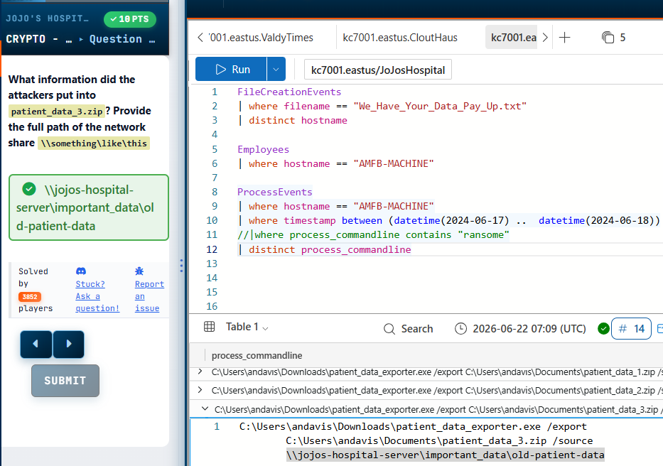
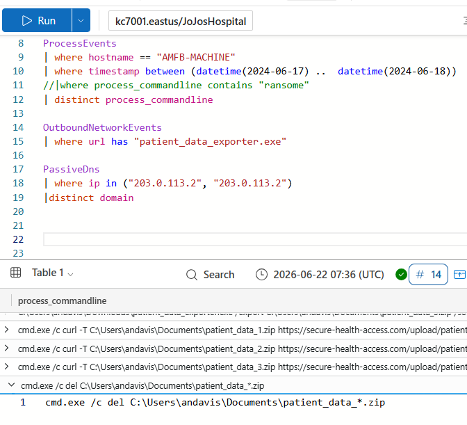
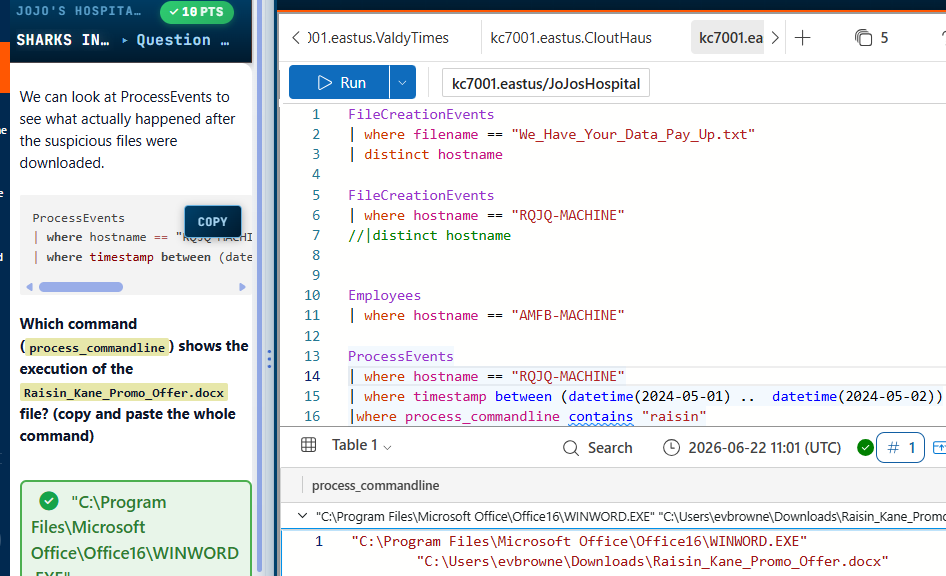
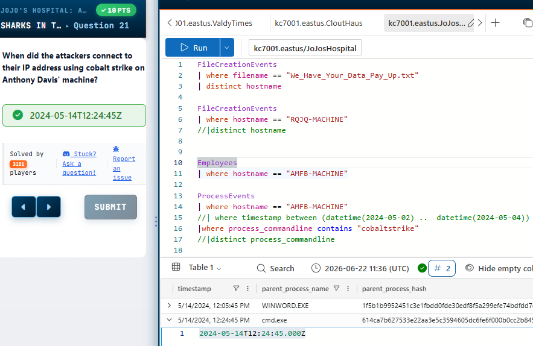
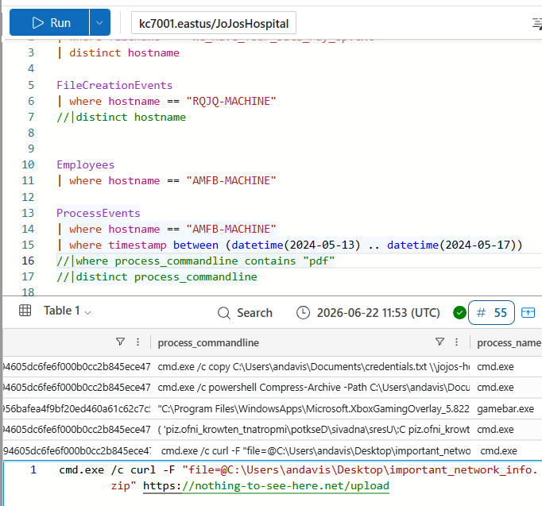

Yes.

I apologize for over-editing; here is your original text with only the requested headers applied, keeping all your original details intact.

```markdown
# KQL SOC Investigation

## Scenario 1
### What tool did the attacker use to steal the data?

I reviewed the ProcessEvents data and focused on the process_commandline field, since it shows executed tools and commands.

To make the data easier to analyze, I sorted the timestamps in ascending order so the earliest activity appears first and the latest last. I also used distinct process command line to reduce noise and focus on unique execution events.

While reviewing the process activity, I identified suspicious file operations related to data exfiltration. One process stood out: patient_data_exporter.exe.

This executable was used to collect patient records and export them into archive files such as patient_data_1.zip. It was targeting files from the hospital’s network share (jojo-hospserver) using a source flag to pull data directly from that location.

Further analysis showed additional archives being created, including patient_data_2.zip and patient_data_3.zip, which contained backup and older patient records.

**Conclusion:** The attacker used patient_data_exporter.exe to steal the data.



---

## Scenario 2
### What command did they use to clear their tracks?

I observed signs of anti-forensics activity where the attacker was deleting the patient_data.zip files that were created during the exfiltration process.

Before focusing only on the deletion, I wanted to trace how the tool itself entered the environment. I moved into OutboundNetworkEvents, following KC7 guidance, to identify how patient_data_exporter.exe was downloaded.

I filtered for URLs containing patient_data_exporter.exe and identified outbound activity from an internal host (10.10.0.1), which mapped to Anthony Davis’s machine. This confirmed the file was downloaded from an external source earlier in the attack chain.

The download was associated with the domain securealthaccess.com, and the file was retrieved on June 17th at approximately 2:22 PM.

Further analysis using PassiveDNS showed that this domain resolved to two distinct IP addresses. One ended in .1 and the other in .2. Additional mapping of these IPs revealed another related domain, including EMR-help, linked to the same infrastructure.

Returning to the main question, the attacker’s final activity involved removing evidence of the exfiltration by deleting the generated archive files.

**Conclusion:** The attacker used a delete command to remove the patient_data.zip files they created (clearing their tracks).



---

## Scenario 3
### Reconnaissance activity against the hospital website

We already identified two attacker IP addresses and associated domains. The next step is to check reconnaissance activity against the hospital website.

I used the InboundNetworkEvents table since it captures inbound web requests into the environment. The attackers’ source IPs were used as filters to isolate their activity.

One important adjustment was using source IP instead of IP, since the dataset does not contain a direct IP field.

After running the query, I observed multiple records (37 events), confirming active browsing behavior from the attacker IPs against internal web resources.

To understand intent, I filtered URLs using the term “bypass”, which showed the attackers were researching ways to bypass security controls at the hospital.

Next, I replaced the keyword with “patient”, which helped identify targeting behavior. Sorting results in ascending order revealed the first request made by the attacker, which was access to hospital patient records. This required extracting the full URL from the earliest event.

After establishing reconnaissance, I moved into AuthenticationEvents to determine whether the attackers used harvested credentials.

This revealed a successful login into Anne Davis’s account on May 20th, 2024 at 12:00 AM. The login was traced back to one of the attacker-controlled IPs (ending in .1), confirming compromise.

**Conclusion:** 
Recon activity: bypassing security controls + targeting patient records   
First patient-related request: hospital patient records (earliest timestamp)   
Compromised account: Anne Davis   
Login source IP: attacker IP ending in .1

---

## Scenario 4
### What is the hostname of the first person to download the suspicious DOCX file?

I used the FileCreationEvents table because it tracks files created on systems. KC7 provided the hint to look for the suspicious DOCX file, so I filtered where the file name matched the document.

Since the question asks for the first person who downloaded it, I reviewed the timestamps and sorted the results in ascending order to find the earliest event.

The first hostname that appeared was RQJQ-.

To identify who this machine belongs to, I checked the Employees table. The hostname mapped to Eva Brown, a lab technician. The associated IP address was 10.10.0.231.

I then checked the file details and confirmed:
Download time: May 1st at 9:56:50 AM   
SHA256 hash: BD8...712   
Browser used: Google Chrome   

Next, I investigated what happened after the DOCX file was downloaded. Using the same victim hostname and timestamp range, I reviewed FileCreationEvents again.

Immediately after the DOCX file, I observed a file called Cobalt Strike being dropped under C:\ProgramData.

Cobalt Strike is a threat emulation/post-exploitation tool that is commonly abused by attackers.

I then checked ProcessEvents to identify the command used to execute the DOCX file. Filtering by the hostname and searching for the document name showed the process command line where Microsoft Word (WINWORD.exe) opened the file.

**Conclusion:** 
First victim host: RQJQ-   
User: Eva Brown (Lab Technician)   
Malicious file dropped: Cobalt Strike   
Browser used: Google Chrome   
DOCX execution: Microsoft Word opened the file   



---

## Scenario 5
### What discovery commands did the attackers run after gaining access?

After gaining access to the hospital network, the attackers started performing discovery activity to gather information about the environment. (In MITRE ATT&CK, this falls under the Discovery tactic)

I reviewed the ProcessEvents table and adjusted the time range between May 2nd and May 4th to focus on attacker activity after malware execution.

I observed multiple discovery commands being executed:
systeminfo   
ipconfig   
netstat   
net user   
net localgroup administrators   
net view   

These commands help attackers understand system information, network configuration, active connections, users, administrator groups, and shared resources.

Following the event timeline, the first discovery command executed was systeminfo.

I also confirmed Anthony Davis’s hostname from previous investigation notes as AMFB-MACHINE.

Next, I checked when the attackers connected using Cobalt Strike on Anthony Davis’s machine. I reviewed the ProcessEvents table using the hostname and looked for Cobalt Strike activity.

The process command line showed the connection occurred on May 14th at 12:24:45 PM.

**Conclusion:** 
First discovery command: systeminfo   
Total discovery commands: 6   
Anthony Davis hostname: AMFB-MACHINE   
Cobalt Strike connection time: May 14th 12:24:45 PM   



---

## Scenario 6
### After gaining access to Anthony Davis’s machine, the attackers downloaded a scanning tool to learn more about the hospital network.

I reviewed the ProcessEvents table and adjusted the timeline between May 13th and May 17th to focus on activity after the attackers gained access.

Since the attackers were performing network discovery, I searched for scanner-related activity within the process command line. I filtered for “scanner” and identified Advanced IP Scanner.exe as the tool used.

Next, I investigated what files the attackers accessed to learn about the network. Since network information is commonly stored in documentation, I searched for PDF files.

The investigation showed the attackers copied network diagrams.pdf from the hospital environment into a network share under the backup directory.

I then followed the timeline after this activity to check if data was actually exfiltrated. The attackers copied credential files, compressed the data using PowerShell, and later used a curl command to upload the archive.

The compressed file was called important_networkinfo.zip and it was sent to nothingtoseehere.net.

**Conclusion:** 
Scanning tool used: Advanced IP Scanner.exe   
Network information file stolen: network diagrams.pdf   
Credential file stolen: credentials.txt   
Exfiltrated archive: important_networkinfo.zip   
Destination domain: nothingtoseehere.net   



---

## Summary
During this investigation, I used KQL in Microsoft security tools to dig deeper into logs by running saved searches and building custom queries. This helped me understand how different datasets connect, identify relevant security events, and improve how I investigate alerts like a SOC analyst.
